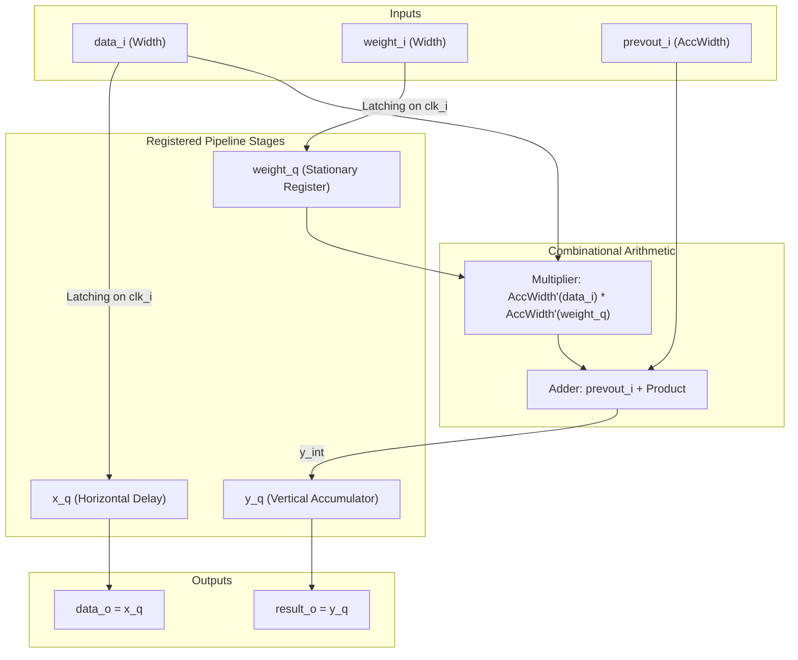
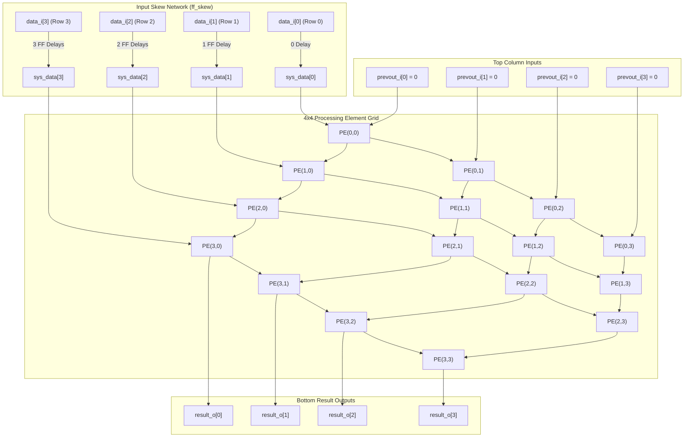
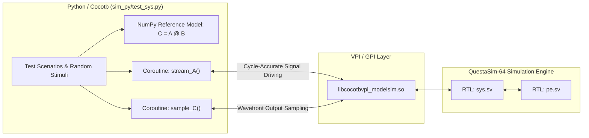

# 2D Weight-Stationary Systolic Array for Hardware GEMM Acceleration

A high-performance, fully synthesizable 2D Systolic Array designed in SystemVerilog for accelerating **General Matrix Multiplication (GEMM)** operations ($C = A \times B$). The design features an $N \times N$ ($4 \times 4$) grid with parameterized data widths, weight-stationary dataflow, an integrated triangular input-skewing network, and a comprehensive dual verification environment utilizing both **SystemVerilog** and **Python / Cocotb**.

---

## Table of Contents
1. [Theoretical Background: Systolic Arrays & Hardware GEMM](#1-theoretical-background-systolic-arrays--hardware-gemm)
   - [What is a Systolic Array?](#what-is-a-systolic-array)
   - [The Memory Wall & Data Reuse](#the-memory-wall--data-reuse)
   - [GEMM Acceleration: Dataflow Paradigms](#gemm-acceleration-dataflow-paradigms)
2. [Hardware Architecture (`RTL/`)](#2-hardware-architecture-rtl)
   - [Processing Element Microarchitecture (`pe.sv`)](#processing-element-microarchitecture-pesv)
   - [2D Systolic Array Grid (`sys.sv`)](#2d-systolic-array-grid-syssv)
   - [Wavefront Timing & Latency Formulation](#wavefront-timing--latency-formulation)
3. [Simulations & Verification Methodology](#3-simulations--verification-methodology)
   - [The Cocotb Cosimulation Flow](#the-cocotb-cosimulation-flow)
   - [Handling Arbitrary Shapes via Zero-Padding](#handling-arbitrary-shapes-via-zero-padding)
   - [SystemVerilog Testbenches](#systemverilog-testbenches)
   - [Test Matrix & Regression Results](#test-matrix--regression-results)
4. [Repository Structure](#4-repository-structure)
5. [Quick Start & Simulation Execution](#5-quick-start--simulation-execution)
6. [Future Developments](#6-future-developments)
7. [Author's Note](#authors-note)

---

## 1. Theoretical Background: Systolic Arrays & Hardware GEMM

### What is a Systolic Array?
Introduced by H.T. Kung and Charles Leiserson in 1978, a **Systolic Array** is an interconnected network of homogeneous processing elements (PEs). In analogy to the human cardiovascular system where the heart rhythmically pumps blood through the body (systole), a systolic array pumps streams of data rhythmically through local, point-to-point connections across neighbouring PEs.


### The Memory Wall & Data Reuse
In traditional Von Neumann architectures (CPUs and conventional DSPs), computing a matrix multiplication of size $N \times N$ requires $O(N^3)$ multiply-accumulate (MAC) operations. Reading operands repeatedly from external DRAM or shared caches creates an unsustainable memory bandwidth bottleneck known as the **Memory Wall**.

A 2D Systolic Array overcomes this limitation by enabling **2-dimensional spatial data reuse**:
- Operands are fetched from memory only **once**.
- As an operand travels through the array, it is reused across multiple PEs in subsequent clock cycles.
- Computation achieves $O(N^2)$ throughput with only $O(N)$ I/O memory bandwidth.

### GEMM Acceleration: Dataflow Paradigms
General Matrix Multiply (GEMM) performs the operation:
$$C = A \times B + C_{\text{prev}}$$

Depending on which matrix remains stationary within the array, hardware architectures are categorized into three primary dataflow paradigms:
1. **Weight-Stationary (WS)**: The weight matrix $B$ is loaded into PE registers and kept static. Matrix $A$ streams horizontally from the left, while partial accumulation results $C$ flow vertically from top to bottom.
2. **Output-Stationary (OS)**: Accumulators remain fixed inside the PEs, while inputs $A$ and weights $B$ stream across rows and columns.
3. **Input-Stationary (IS)**: Activations $A$ remain pinned inside the PEs, while weights and partial sums travel.

> [!NOTE]
> This design implements the **Weight-Stationary (WS)** dataflow (similar to the Google TPU v1 architecture). Weight-Stationary architectures minimize energy consumption associated with reading weights, making them ideal for deep neural network inference where model parameters remain constant across multiple input batches.

---

## 2. Hardware Architecture (`RTL/`)

The hardware implementation is organized into two hierarchical SystemVerilog modules located in `RTL/`:
- [`RTL/pe.sv`](RTL/pe.sv): The fundamental processing cell.
- [`RTL/sys.sv`](RTL/sys.sv): The 2D systolic array integration with skewing registers and boundary connections.

### Processing Element Microarchitecture (`pe.sv`)

Each Processing Element executes a Multiply-Accumulate (MAC) operation in each clock cycle:
$$y = y_{\text{prev}} + x \times w$$

#### Parameters
| Parameter | Default Value | Description |
|---|---|---|
| `Width` | `8` | Data bit-width for input activation $x$ and weight $w$ |
| `AccWidth` | `32` | Extended accumulator bit-width to prevent arithmetic overflow |

#### PE Block Diagram



#### Microarchitecture Details
- **Weight Register (`weight_q`)**: Latches `weight_i` synchronously on reset release. In stationary operation, this value remains unchanged during the inference stream.
- **Horizontal Forwarding Register (`x_q`)**: Delays `data_i` by 1 clock cycle before forwarding to the right neighbour (`data_o`).
- **Vertical Accumulator Register (`y_q`)**: Computes `y_int = prevout_i + (data_i * weight_q)` combinationally and latches it into `y_q` on each clock edge, outputting to the lower PE (`result_o`).

---

### 2D Systolic Array Grid (`sys.sv`)

The top-level module instantiates a $4 \times 4$ mesh of PEs (`Matrix_N = 4`), integrating the triangular input skewing registers on the left and routing partial sums downward.



#### Triangular Skewing Network
In a matrix multiplication $C = A \times B$, entry $C_{i, c} = \sum_{k=0}^{N-1} A_{i, k} B_{k, c}$.
- PE at row $k$ contains weight $B_{k, c}$.
- Input operand $A_{i, k}$ must reach PE $(k, c)$ simultaneously with the partial accumulation arriving from PE $(k-1, c)$.
- To align arrival times across all rows, the input network introduces an artificial skew:
  $$\text{Delay}(\text{Row } r) = r \quad [\text{clock cycles}]$$
  - Row 0: 0 register delays (direct wire connection).
  - Row 1: 1 flip-flop delay stage.
  - Row 2: 2 cascaded flip-flop delay stages.
  - Row 3: 3 cascaded flip-flop delay stages.

---

### Wavefront Timing & Latency Formulation

Due to the horizontal skew network and the 1-cycle pipeline delay per PE in both horizontal and vertical directions, data moves across the array in diagonal waves.

#### Output Wavefront Timing Table ($4 \times 4$)
| Clock Cycle ($T$) | `result_o[0]` | `result_o[1]` | `result_o[2]` | `result_o[3]` |
| :---: | :---: | :---: | :---: | :---: |
| **Cycle 4** | **$C_{0, 0}$** | - | - | - |
| **Cycle 5** | **$C_{1, 0}$** | **$C_{0, 1}$** | - | - |
| **Cycle 6** | **$C_{2, 0}$** | **$C_{1, 1}$** | **$C_{0, 2}$** | - |
| **Cycle 7** | **$C_{3, 0}$** | **$C_{2, 1}$** | **$C_{1, 2}$** | **$C_{0, 3}$** |
| **Cycle 8** | - | **$C_{3, 1}$** | **$C_{2, 2}$** | **$C_{1, 3}$** |
| **Cycle 9** | - | - | **$C_{3, 2}$** | **$C_{2, 3}$** |
| **Cycle 10** | - | - | - | **$C_{3, 3}$** |

- Total execution time for a full $4 \times 4$ GEMM: **11 clock cycles** (from cycle 0 to cycle 10).
- High pipeline efficiency: intermediate partial results are continuously computed concurrently across the array.

---

## 3. Simulations & Verification Methodology

The verification suite provides comprehensive coverage using two complementary methodologies:
1. **Python / Cocotb Cosimulation Environment** ([`sim_py/`](sim_py/))
2. **Native SystemVerilog Testbenches** ([`sim/`](sim/))

### The Cocotb Cosimulation Flow

**Cocotb** (Coroutine-based Cosimulation Testbench) enables writing high-level, expressive hardware testbenches in Python while communicating directly with HDL simulators (e.g. QuestaSim-64) via the standard **VPI** (Verilog Procedural Interface).



#### Why Cocotb?
- **Effortless Golden Model Verification**: Matrix multiplication reference results are calculated instantaneously with NumPy (`C_expected = A @ B`).
- **Concurrent Coroutines**: Uses Python `async/await` syntax to run the input streaming process (`stream_A`) concurrently with the output sampling process (`sample_C`).
- **Dynamic Assertions**: Full numerical array assertions (`np.array_equal`) with clean matrix formatting in failure diagnostics.

---

### Handling Arbitrary Shapes via Zero-Padding

The hardware array has a fixed physical dimension of $4 \times 4$. To support general rectangular matrix operations with arbitrary active dimensions:
$$(M \times K) \times (K \times P) \quad \text{where } M, K, P \le 4$$

We apply **zero-padding** to pad both matrices to $4 \times 4$:
$$A_{\text{pad}} = \begin{bmatrix} A_{M \times K} & \mathbf{0}_{M \times (4-K)} \\ \mathbf{0}_{(4-M) \times K} & \mathbf{0}_{(4-M) \times (4-K)} \end{bmatrix}, \quad B_{\text{pad}} = \begin{bmatrix} B_{K \times P} & \mathbf{0}_{K \times (4-P)} \\ \mathbf{0}_{(4-K) \times P} & \mathbf{0}_{(4-K) \times (4-P)} \end{bmatrix}$$

Because inactive inputs and weights are zero, the partial accumulation properties ensure that:
$$C_{\text{pad}}[i][j] = \sum_{k=0}^{K-1} A[i][k] \cdot B[k][j] + \sum_{k=K}^{3} 0 \cdot 0 = C[i][j]$$

The active submatrix $C_{M \times P}$ is then cleanly extracted from $C_{\text{pad}}[:M, :P]$.

---

### SystemVerilog Testbenches

For native HDL verification without Python dependencies:
- [`sim/tb_pe.sv`](sim/tb_pe.sv): Unit testbench for individual PE verification. Validates stationary weight latching, MAC arithmetic, and data passthrough.
- [`sim/tb_sys.sv`](sim/tb_sys.sv): End-to-end testbench for `sys.sv`. Includes 10 automated test cases (Identity, Known Values, Rectangular Padded Shapes, and Randomized 4x4 Matrices).

---

### Test Matrix & Regression Results

| Test ID | Test Category | Effective Shape | Description | Cocotb Status | SV Status |
|---|---|---|---|:---:|:---:|
| **Test 1** | Identity Matrix | $(4 \times 4) \times (4 \times 4)$ | $A \times I = A$ (Verifies neutral element preservation) | **PASS** | **PASS** |
| **Test 2** | Known Values | $(4 \times 4) \times (4 \times 4)$ | Handcrafted integer values verifying every PE cell | **PASS** | **PASS** |
| **Test 3** | Rectangular Padded | $(2 \times 3) \times (3 \times 4)$ | $M=2, K=3, P=4$ with zero-padding | **PASS** | **PASS** |
| **Test 4** | Reduced Square | $(2 \times 2) \times (2 \times 2)$ | Small $2 \times 2$ submatrix embedded in $4 \times 4$ | **PASS** | **PASS** |
| **Test 5** | Rectangular Padded | $(3 \times 2) \times (2 \times 4)$ | Asymmetric inner dimension $K=2$ with zero-padding | **PASS** | **PASS** |
| **Test 6** | Random Matrices | $(4 \times 4) \times (4 \times 4)$ | Multi-iteration random matrices with values $\in [0, 100]$ | **PASS** | **PASS** |
| **Test 7** | Random Shapes | Multiple | $1 \times 4$, $4 \times 1$, $3 \times 3$, $1 \times 2$ padded shapes | **PASS** | **PASS** |

#### Summary of Cocotb Regression Output:
```text
***********************************************************************************************
** TEST                                   STATUS  SIM TIME (ns)  REAL TIME (s)  RATIO (ns/s) **
***********************************************************************************************
** test_sys.test_01_identity               PASS         150.00           0.00      61337.35  **
** test_sys.test_02_known_values           PASS         160.00           0.00      94548.40  **
** test_sys.test_03_padded_2x3_by_3x4      PASS         160.00           0.00     104417.04  **
** test_sys.test_04_padded_2x2_by_2x2      PASS         160.00           0.00     104317.10  **
** test_sys.test_05_padded_3x2_by_2x4      PASS         160.00           0.00     102897.46  **
** test_sys.test_06_random_full_4x4        PASS         800.00           0.02      35397.23  **
** test_sys.test_07_random_padded_shapes   PASS         640.00           0.01      93803.21  **
***********************************************************************************************
** TESTS=7 PASS=7 FAIL=0 SKIP=0                        2230.01           0.04      55887.96  **
***********************************************************************************************
```

---

## 4. Repository Structure

```plaintext
SystolicArray2D/
├── README.md                      # Project documentation and architectural overview
├── RTL/                           # Synthesizable SystemVerilog RTL source files
│   ├── pe.sv                      # Processing Element module (Multiply-Accumulate)
│   └── sys.sv                     # 2D Systolic Array top module (Skew network + Grid)
├── sim/                           # Native SystemVerilog simulation environment
│   ├── run.do                     # QuestaSim TCL script for PE testbench
│   ├── run_sys.do                 # QuestaSim TCL script for 2D Systolic Array testbench
│   ├── tb_pe.sv                   # Testbench for Processing Element
│   └── tb_sys.sv                  # Testbench for 2D Systolic Array
└── sim_py/                        # Python / Cocotb cosimulation environment
    ├── Makefile                   # Cocotb build configuration for QuestaSim/ModelSim
    ├── run.sh                     # Automated runner script
    ├── test_sys.py                # Asynchronous Cocotb GEMM test suite
    └── Simulation_results.MD      # Detailed simulation and verification report
```

---

## 5. Quick Start & Simulation Execution

### Prerequisites
- **HDL Simulator**: Siemens QuestaSim or ModelSim (installed and available in `PATH`).
- **Python**: Version 3.10+ with `cocotb` and `numpy`.

---

### Running Cocotb Python Tests (Recommended)

#### Option A: Using the Automated Runner Script
```bash
cd sim_py
./run.sh
```

#### Option B: Using Make Directly
```bash
cd sim_py
source ../.venv/bin/activate
make SIM=modelsim
```

#### Option C: Interactive Waveform GUI
To launch the QuestaSim graphical interface and inspect signals interactively during Python test execution:
```bash
cd sim_py
source ../.venv/bin/activate
make SIM=modelsim GUI=1
```

---

### Running Native SystemVerilog Simulations

#### 1. Processing Element (`pe.sv`) Simulation
```bash
cd sim
vsim -c -do "do run.do; quit -f"
```

#### 2. Full 2D Systolic Array (`sys.sv`) Simulation
```bash
cd sim
vsim -c -do "do run_sys.do; quit -f"
```

To run in QuestaSim GUI mode:
```bash
cd sim
vsim -do run_sys.do
```

---

### Cleaning Simulation Artifacts

To remove all compiled libraries (`work/`, `sim_build/`), simulation transcripts, waveform dumps (`*.wlf`, `*.vcd`), and temporary reports:

From `sim/`:
```bash
cd sim
make clean
```

From `sim_py/`:
```bash
cd sim_py
make clean
```

---

## 6. Future Developments

- **Hardware Weight Loading**: Implement a serial/systolic shift-register chain to stream weights into PEs, eliminating the parallel I/O pin bottleneck for larger matrices.
- **Clock Gating (Low-Power)**: Add clock enable logic to gate clock signals to inactive PEs during zero-padded sub-matrix multiplications, cutting dynamic power.
- **Output De-skewing Network**: Integrate a triangular de-skew FIFO buffer at the bottom outputs to realign the diagonal wavefront into full, single-cycle result rows.

---

## 7. Author's Note

> [!NOTE]
> **NOTE**: The SystemVerilog RTL design located in `RTL/` was written entirely by the author without the assistance of AI models. Conversely, the verification environments in `sim/` and `sim_py/`, along with this `README.md`, were developed with the assistance of AI models (Gemini 3.8 Flash High).
