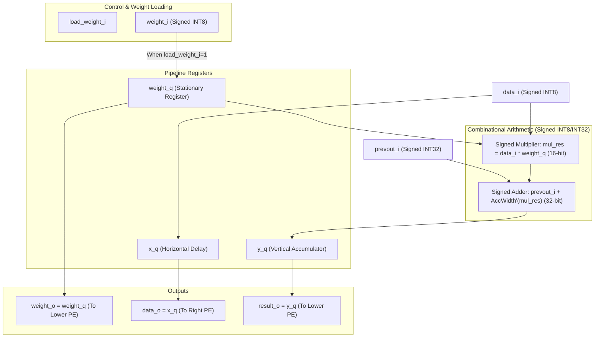
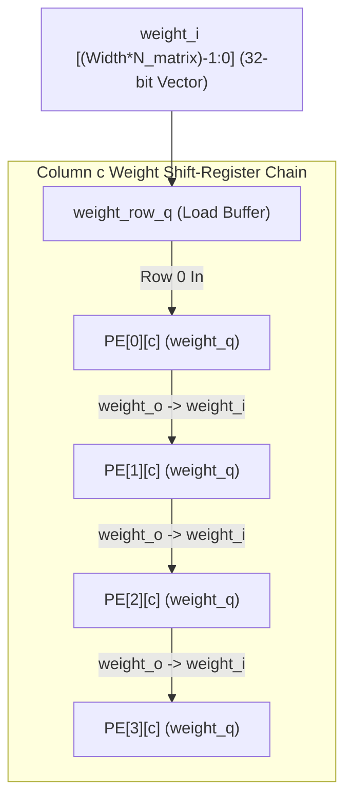
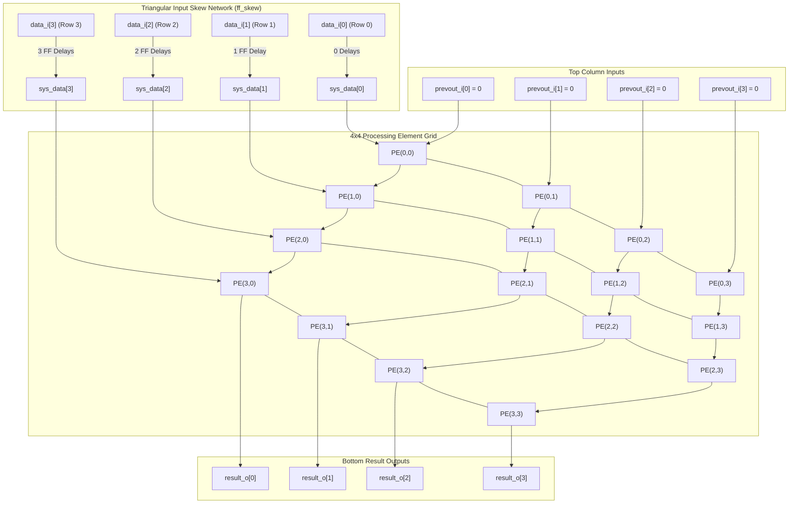
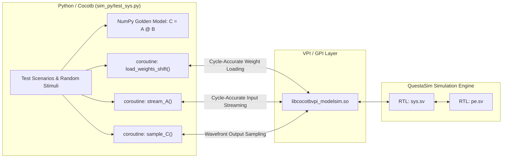

# 2D Weight-Stationary Systolic Array for Hardware GEMM Acceleration

A high-performance, fully synthesizable 2D Systolic Array designed in SystemVerilog for accelerating **General Matrix Multiplication (GEMM)** operations ($C = A \times B$) with signed **INT8** operands and **INT32** accumulation. The design features an $N \times N$ ($4 \times 4$) grid with parameterized data widths, weight-stationary dataflow, an integrated triangular input-skewing network, a **systolic shift-register weight loading architecture**, and a comprehensive dual verification environment utilizing both **Native SystemVerilog (QuestaSim)** and **Python / Cocotb**.

---

## Table of Contents
1. [Theoretical Background: Systolic Arrays & Hardware GEMM](#1-theoretical-background-systolic-arrays--hardware-gemm)
   - [What is a Systolic Array?](#what-is-a-systolic-array)
   - [The Memory Wall & Data Reuse](#the-memory-wall--data-reuse)
   - [GEMM Acceleration: Dataflow Paradigms](#gemm-acceleration-dataflow-paradigms)
2. [Hardware Architecture (`RTL/`)](#2-hardware-architecture-rtl)
   - [Processing Element Microarchitecture (`pe.sv`)](#processing-element-microarchitecture-pesv)
   - [Systolic Weight Loading Mechanism (Shift-Register Chain)](#systolic-weight-loading-mechanism-shift-register-chain)
   - [2D Systolic Array Grid (`sys.sv`)](#2d-systolic-array-grid-syssv)
   - [Wavefront Timing & Latency Formulation](#wavefront-timing--latency-formulation)
3. [Simulations & Verification Methodology](#3-simulations--verification-methodology)
   - [The Cocotb Cosimulation Flow](#the-cocotb-cosimulation-flow)
   - [Native SystemVerilog Verification Suite](#native-systemverilog-verification-suite)
   - [Handling Arbitrary Shapes via Zero-Padding](#handling-arbitrary-shapes-via-zero-padding)
   - [Test Matrix & Regression Results](#test-matrix--regression-results)
4. [Repository Structure](#4-repository-structure)
5. [Quick Start & Simulation Execution](#5-quick-start--simulation-execution)
6. [Future Developments & Roadmap](#6-future-developments--roadmap)
7. [Author's Note](#authors-note)

---

## 1. Theoretical Background: Systolic Arrays & Hardware GEMM

### What is a Systolic Array?
Introduced by H.T. Kung and Charles Leiserson in 1978, a **Systolic Array** is an interconnected network of homogeneous processing elements (PEs). In analogy to the human cardiovascular system where the heart rhythmically pumps blood through the body (systole), a systolic array pumps streams of data rhythmically through local, point-to-point connections across neighbouring PEs.


```mermaid
flowchart LR
    MEM_IN["Memory / Buffer"] -->|"Data Wavefront (Rhythmic Pumping)"| PE1["PE (0,0)"]
    PE1 -->|"Local Forwarding"| PE2["PE (0,1)"]
    PE2 -->|"Local Forwarding"| PE3["PE (0,2)"]
    PE3 -->|"Local Forwarding"| PE4["PE (0,3)"]
    PE4 -->|"Output Collection"| MEM_OUT["Result Buffer"]
```

### The Memory Wall & Data Reuse
In traditional Von Neumann architectures (CPUs and conventional DSPs), computing a matrix multiplication of size $N \times N$ requires $O(N^3)$ multiply-accumulate (MAC) operations. Reading operands repeatedly from external DRAM or shared caches creates an unsustainable memory bandwidth bottleneck known as the **Memory Wall**.

A 2D Systolic Array overcomes this limitation by enabling **2-dimensional spatial data reuse**:
- Operands are fetched from memory only **once**.
- As an operand travels through the array, it is reused across multiple PEs in subsequent clock cycles.
- Computation achieves $O(N^2)$ throughput with only $O(N)$ I/O memory bandwidth.

### GEMM Acceleration: Dataflow Paradigms
General Matrix Multiply (GEMM) performs the operation:
$$C = A \times B + C_{\text{prev}}$$

Depending on which matrix remains stationary within the array, hardware architectures are categorized into three primary dataflow paradigms:
1. **Weight-Stationary (WS)**: The weight matrix $B$ is loaded into PE registers and kept static. Matrix $A$ streams horizontally from the left, while partial accumulation results $C$ flow vertically from top to bottom.
2. **Output-Stationary (OS)**: Accumulators remain fixed inside the PEs, while inputs $A$ and weights $B$ stream across rows and columns.
3. **Input-Stationary (IS)**: Activations $A$ remain pinned inside the PEs, while weights and partial sums travel.

> [!NOTE]
> This design implements the **Weight-Stationary (WS)** dataflow (similar to the Google TPU v1 architecture). Weight-Stationary architectures minimize energy consumption associated with reading weights, making them ideal for deep neural network inference where model parameters remain constant across multiple input batches.

---

## 2. Hardware Architecture (`RTL/`)

The hardware implementation is organized into two hierarchical SystemVerilog modules located in `RTL/`:
- [`RTL/pe.sv`](RTL/pe.sv): The fundamental processing cell with synchronous weight-latching logic.
- [`RTL/sys.sv`](RTL/sys.sv): The 2D systolic array integration with triangular skewing network, vertical shift-register weight loading chain, and boundary routing.

### Processing Element Microarchitecture (`pe.sv`)

Each Processing Element executes a Multiply-Accumulate (MAC) operation in each clock cycle:
$$y = y_{\text{prev}} + x \times w$$

#### Parameters
| Parameter | Default Value | Description |
|---|---|---|
| `Width` | `8` | Data bit-width for signed input activation $x$ and weight $w$ (INT8, range $[-128, 127]$) |
| `AccWidth` | `32` | Extended signed accumulator bit-width to prevent arithmetic overflow (INT32) |

#### Ports
| Port Name | Direction | Type | Description |
|---|---|---|---|
| `clk_i` | Input | `logic` | System clock |
| `rst_i` | Input | `logic` | Asynchronous/synchronous reset |
| `load_weight_i` | Input | `logic` | Weight load enable (asserted during weight configuration phase) |
| `data_i` | Input | `logic signed [Width-1:0]` | Horizontal data activation input |
| `weight_i` | Input | `logic signed [Width-1:0]` | Weight input from shift-register chain |
| `weight_o` | Output | `logic signed [Width-1:0]` | Weight output forwarded to the next PE row |
| `prevout_i` | Input | `logic signed [AccWidth-1:0]` | Vertical incoming partial sum |
| `result_o` | Output | `logic signed [AccWidth-1:0]` | Accumulated partial sum output to lower PE |
| `data_o` | Output | `logic signed [Width-1:0]` | Forwarded activation output to right PE |

#### PE Block Diagram


```mermaid
flowchart TD
    subgraph Control ["Control & Weight Loading"]
        LOAD_EN["load_weight_i"]
        W_IN["weight_i (Signed INT8)"]
    end

    subgraph Internal_Registers ["Pipeline Registers"]
        REG_W["weight_q (Stationary Register)"]
        REG_X["x_q (Horizontal Delay)"]
        REG_Y["y_q (Vertical Accumulator)"]
    end

    subgraph MAC_Unit ["Combinational Arithmetic (Signed INT8/INT32)"]
        MULT["Signed Multiplier: mul_res = data_i * weight_q (16-bit)"]
        ADDER["Signed Adder: prevout_i + AccWidth'(mul_res) (32-bit)"]
    end

    subgraph Outputs ["Outputs"]
        W_OUT["weight_o = weight_q (To Lower PE)"]
        DATA_OUT["data_o = x_q (To Right PE)"]
        RES_OUT["result_o = y_q (To Lower PE)"]
    end

    W_IN -->|"When load_weight_i=1"| REG_W
    REG_W --> W_OUT
    REG_W --> MULT

    DATA_IN["data_i (Signed INT8)"] --> REG_X
    REG_X --> DATA_OUT
    DATA_IN --> MULT

    PREV_IN["prevout_i (Signed INT32)"] --> ADDER
    MULT --> ADDER
    ADDER --> REG_Y
    REG_Y --> RES_OUT
```

#### Microarchitecture Details
- **Signed Arithmetic (INT8 / INT32)**: All PE data ports and internal registers use SystemVerilog `signed` types, supporting full two's-complement arithmetic with negative weights and activations.
- **Conditional Weight Loading (`weight_q`)**: When `load_weight_i == 1'b1`, `weight_q` latches `weight_i`. When `load_weight_i == 1'b0`, `weight_q` retains its stored value, ensuring strict weight-stationary operation during GEMM execution.
- **Vertical Weight Cascading (`weight_o`)**: Directly exposes `weight_q` to the downstream PE in the column, forming a vertical shift-register chain for configuration.
- **Horizontal Forwarding Register (`x_q`)**: Delays signed `data_i` by 1 clock cycle before forwarding to the right neighbour (`data_o`).
- **Signed Accumulator Register (`y_q`)**: Accumulates incoming `prevout_i` with sign-extended `AccWidth'(data_i * weight_q)` and registers the output.

---

### Systolic Weight Loading Mechanism (Shift-Register Chain)

To eliminate the I/O pin bottleneck of loading a full $N \times N$ matrix in parallel (which would require $N \times N \times \text{Width} = 128$ bits for a $4 \times 4$ INT8 array), the architecture employs a **serial-parallel vertical shift-register loading network**:

- **External Weight Bus (`weight_i`)**: Reduced to a single row vector of $N \times \text{Width}$ bits ($4 \times 8 = 32$ bits).
- **Shift Direction**: Weights enter the top row ($r=0$) and shift downward through columns:
  $$\text{weight\_int}[r][c] = \begin{cases} \text{weight\_row\_q}[c] & \text{if } r = 0 \\ \text{pe\_weight}[r-1][c] & \text{if } r > 0 \end{cases}$$


```mermaid
flowchart TD
    W_BUS["weight_i [(Width*N_matrix)-1:0] (32-bit Vector)"] --> REG_IN["weight_row_q (Load Buffer)"]
    
    subgraph Col_C ["Column c Weight Shift-Register Chain"]
        REG_IN -->|"Row 0 In"| PE0["PE[0][c] (weight_q)"]
        PE0 -->|"weight_o -> weight_i"| PE1["PE[1][c] (weight_q)"]
        PE1 -->|"weight_o -> weight_i"| PE2["PE[2][c] (weight_q)"]
        PE2 -->|"weight_o -> weight_i"| PE3["PE[3][c] (weight_q)"]
    end
```

#### Weight Streaming Protocol (Order of Arrival)
Because weights flow from top to bottom, the row destined for the bottom row (`PE[3]`) must be injected first. To load matrix $B$:
$$\text{Cycle 1: Row 3 } (B[3]) \longrightarrow \text{Cycle 2: Row 2 } (B[2]) \longrightarrow \text{Cycle 3: Row 1 } (B[1]) \longrightarrow \text{Cycle 4: Row 0 } (B[0])$$

After 4 clock cycles with `load_weight_i = 1`, all 16 PEs hold their respective target weights:
- `PE[0]` contains Row 0
- `PE[1]` contains Row 1
- `PE[2]` contains Row 2
- `PE[3]` contains Row 3

Setting `load_weight_i = 0` locks the weights in place, allowing the inference data stream to begin immediately.

---

### 2D Systolic Array Grid (`sys.sv`)

The top-level module instantiates the $N \times N$ mesh of PEs (`N_matrix = 4`), integrating the triangular input skewing registers on the left and routing partial sums downward.


```mermaid
flowchart TD
    subgraph Skew_Network ["Triangular Input Skew Network (ff_skew)"]
        IN0["data_i[0] (Row 0)"] -->|"0 Delays"| S0["sys_data[0]"]
        IN1["data_i[1] (Row 1)"] -->|"1 FF Delay"| S1["sys_data[1]"]
        IN2["data_i[2] (Row 2)"] -->|"2 FF Delays"| S2["sys_data[2]"]
        IN3["data_i[3] (Row 3)"] -->|"3 FF Delays"| S3["sys_data[3]"]
    end

    subgraph Top_Inputs ["Top Column Inputs"]
        P0["prevout_i[0] = 0"]
        P1["prevout_i[1] = 0"]
        P2["prevout_i[2] = 0"]
        P3["prevout_i[3] = 0"]
    end

    subgraph Grid ["4x4 Processing Element Grid"]
        PE00["PE(0,0)"] --- PE01["PE(0,1)"] --- PE02["PE(0,2)"] --- PE03["PE(0,3)"]
        PE10["PE(1,0)"] --- PE11["PE(1,1)"] --- PE12["PE(1,2)"] --- PE13["PE(1,3)"]
        PE20["PE(2,0)"] --- PE21["PE(2,1)"] --- PE22["PE(2,2)"] --- PE23["PE(2,3)"]
        PE30["PE(3,0)"] --- PE31["PE(3,1)"] --- PE32["PE(3,2)"] --- PE33["PE(3,3)"]
    end

    subgraph Bottom_Outputs ["Bottom Result Outputs"]
        R0["result_o[0]"]
        R1["result_o[1]"]
        R2["result_o[2]"]
        R3["result_o[3]"]
    end

    S0 --> PE00
    S1 --> PE10
    S2 --> PE20
    S3 --> PE30

    P0 --> PE00 --> PE10 --> PE20 --> PE30 --> R0
    P1 --> PE01 --> PE11 --> PE21 --> PE31 --> R1
    P2 --> PE02 --> PE12 --> PE22 --> PE32 --> R2
    P3 --> PE03 --> PE13 --> PE23 --> PE33 --> R3
```

#### Triangular Skewing Network
In a matrix multiplication $C = A \times B$, entry $C_{i, c} = \sum_{k=0}^{N-1} A_{i, k} B_{k, c}$.
- PE at row $k$ contains weight $B_{k, c}$.
- Input operand $A_{i, k}$ must reach PE $(k, c)$ simultaneously with the partial accumulation arriving from PE $(k-1, c)$.
- To align arrival times across all rows, the input network introduces an artificial skew:
  $$\text{Delay}(\text{Row } r) = r \quad [\text{clock cycles}]$$
  - Row 0: 0 register delays (direct wire connection).
  - Row 1: 1 flip-flop delay stage.
  - Row 2: 2 cascaded flip-flop delay stages.
  - Row 3: 3 cascaded flip-flop delay stages.

---

### Wavefront Timing & Latency Formulation

Due to the horizontal skew network and the 1-cycle pipeline delay per PE in both horizontal and vertical directions, data moves across the array in diagonal waves.

#### Output Wavefront Timing Table ($4 \times 4$)
| Clock Cycle ($T$) | `result_o[0]` | `result_o[1]` | `result_o[2]` | `result_o[3]` |
| :---: | :---: | :---: | :---: | :---: |
| **Cycle 4** | **$C_{0, 0}$** | - | - | - |
| **Cycle 5** | **$C_{1, 0}$** | **$C_{0, 1}$** | - | - |
| **Cycle 6** | **$C_{2, 0}$** | **$C_{1, 1}$** | **$C_{0, 2}$** | - |
| **Cycle 7** | **$C_{3, 0}$** | **$C_{2, 1}$** | **$C_{1, 2}$** | **$C_{0, 3}$** |
| **Cycle 8** | - | **$C_{3, 1}$** | **$C_{2, 2}$** | **$C_{1, 3}$** |
| **Cycle 9** | - | - | **$C_{3, 2}$** | **$C_{2, 3}$** |
| **Cycle 10** | - | - | - | **$C_{3, 3}$** |

- Total execution time for a full $4 \times 4$ GEMM: **11 clock cycles** (from cycle 0 to cycle 10).
- Total configuration time for weight loading: **4 clock cycles**.

---

## 3. Simulations & Verification Methodology

The verification suite provides complete verification coverage across two parallel environments:
1. **Native SystemVerilog Testbenches** ([`sim/`](sim/)) targeting Siemens QuestaSim / ModelSim.
2. **Python / Cocotb Cosimulation Environment** ([`sim_py/`](sim_py/)) with NumPy golden models.

### The Cocotb Cosimulation Flow

**Cocotb** (Coroutine-based Cosimulation Testbench) communicates directly with QuestaSim via the standard **VPI** (Verilog Procedural Interface), enabling high-level automated testing with Python and NumPy.


```mermaid
flowchart LR
    subgraph Python_Testbench ["Python / Cocotb (sim_py/test_sys.py)"]
        PY_TB["Test Scenarios & Random Stimuli"]
        NUMPY["NumPy Golden Model: C = A @ B"]
        LOAD_W["coroutine: load_weights_shift()"]
        ASYNC_DRIVE["coroutine: stream_A()"]
        ASYNC_SAMPLE["coroutine: sample_C()"]
    end

    subgraph Interconnect ["VPI / GPI Layer"]
        LIBVPI["libcocotbvpi_modelsim.so"]
    end

    subgraph Simulator ["QuestaSim Simulation Engine"]
        HDL_SYS["RTL: sys.sv"]
        HDL_PE["RTL: pe.sv"]
    end

    PY_TB --> NUMPY
    PY_TB --> LOAD_W
    PY_TB --> ASYNC_DRIVE
    PY_TB --> ASYNC_SAMPLE
    LOAD_W <-->|"Cycle-Accurate Weight Loading"| LIBVPI
    ASYNC_DRIVE <-->|"Cycle-Accurate Input Streaming"| LIBVPI
    ASYNC_SAMPLE <-->|"Wavefront Output Sampling"| LIBVPI
    LIBVPI <--> HDL_SYS
    HDL_SYS <--> HDL_PE
```

### Native SystemVerilog Verification Suite

For independent HDL verification without Python dependencies:
- [`sim/tb_pe.sv`](sim/tb_pe.sv): Verifies PE reset, conditional weight loading with `load_weight_i`, weight retention under varied inputs, signed INT8/INT32 MAC arithmetic, and boundary values ($-128, 127$).
- [`sim/tb_sys.sv`](sim/tb_sys.sv): Top-level array testbench implementing the shift-register loading protocol, automated **white-box hardware diagnostics** on internal PE registers (`dut.gen_pe_row[r].gen_pe_col[c].u_pe.weight_q`), and full GEMM verification.

---

### Handling Arbitrary Shapes via Zero-Padding

The hardware array has a fixed physical dimension of $4 \times 4$. To support general rectangular matrix operations with arbitrary active dimensions:
$$(M \times K) \times (K \times P) \quad \text{where } M, K, P \le 4$$

We apply **zero-padding** to pad both matrices to $4 \times 4$:
$$A_{\text{pad}} = \begin{bmatrix} A_{M \times K} & \mathbf{0}_{M \times (4-K)} \\ \mathbf{0}_{(4-M) \times K} & \mathbf{0}_{(4-M) \times (4-K)} \end{bmatrix}, \quad B_{\text{pad}} = \begin{bmatrix} B_{K \times P} & \mathbf{0}_{K \times (4-P)} \\ \mathbf{0}_{(4-K) \times P} & \mathbf{0}_{(4-K) \times (4-P)} \end{bmatrix}$$

The active submatrix $C_{M \times P}$ is extracted from $C_{\text{pad}}[:M, :P]$.

---

### Test Matrix & Regression Results

| Test ID | Test Category | Effective Shape | Description | Cocotb Status | QuestaSim Status |
|---|---|---|---|:---:|:---:|
| **Test 1** | Weight Load Diagnostic | $(4 \times 4)$ | Verifies shift-register latching and inspects all 16 internal PE registers | **PASS** | **PASS** |
| **Test 2** | Identity Matrix | $(4 \times 4) \times (4 \times 4)$ | $A \times I = A$ (Verifies neutral element preservation) | **PASS** | **PASS** |
| **Test 3** | Known Numerical Values | $(4 \times 4) \times (4 \times 4)$ | Handcrafted integer values verifying every PE cell | **PASS** | **PASS** |
| **Test 4** | Rectangular Padded | $(2 \times 3) \times (3 \times 4)$ | $M=2, K=3, P=4$ with zero-padding | **PASS** | **PASS** |
| **Test 5** | Reduced Square | $(2 \times 2) \times (2 \times 2)$ | Small $2 \times 2$ submatrix embedded in $4 \times 4$ | **PASS** | **PASS** |
| **Test 6** | Signed INT8 Random | $(4 \times 4) \times (4 \times 4)$ | Multi-iteration signed INT8 GEMM with negative values in $[-50, 50)$ | **PASS** | **PASS** |
| **Test PE** | Unit PE Verification | $1 \times 1$ | Unit testbench verifying reset, load enable, retention, and MAC | **PASS** | **PASS** |

#### Cocotb Regression Summary:
```text
****************************************************************************************************
** TEST                                        STATUS  SIM TIME (ns)  REAL TIME (s)  RATIO (ns/s) **
****************************************************************************************************
** test_sys.test_01_weight_loading_diagnostic   PASS          80.00           0.00      23061.31  **
** test_sys.test_02_identity                    PASS         220.00           0.00      67542.14  **
** test_sys.test_03_known_values                PASS         220.00           0.00      73270.30  **
** test_sys.test_04_padded_2x3_by_3x4           PASS         220.00           0.00      75009.83  **
** test_sys.test_05_signed_random               PASS         220.00           0.01      14996.39  **
****************************************************************************************************
** TESTS=5 PASS=5 FAIL=0 SKIP=0                              960.00           0.03      33681.11  **
****************************************************************************************************
```

#### QuestaSim Native Regression Summary:
```text
================================================================
   ALL TESTS COMPLETED SUCCESSFULLY! (0 ERRORS)                
================================================================
```

---

## 4. Repository Structure

```plaintext
SystolicArray2D/
├── README.md                      # Project documentation and architectural overview
├── RTL/                           # Synthesizable SystemVerilog RTL source files
│   ├── pe.sv                      # Processing Element module (Signed INT8 MAC + Weight Latching)
│   └── sys.sv                     # 2D Systolic Array top module (Grid + Shift-Register Loader + Skew)
├── sim/                           # Native SystemVerilog simulation environment (QuestaSim)
│   ├── Makefile                   # Batch simulation runner for PE and Systolic Array
│   ├── run.do                     # QuestaSim TCL script for PE testbench
│   ├── run_sys.do                 # QuestaSim TCL script for 2D Systolic Array testbench
│   ├── tb_pe.cpp                  # C++ / Verilator unit testbench for PE
│   ├── tb_pe.sv                   # SystemVerilog testbench for Processing Element
│   └── tb_sys.sv                  # SystemVerilog testbench with automated hardware diagnostic
└── sim_py/                        # Python / Cocotb cosimulation environment
    ├── Makefile                   # Cocotb build configuration for QuestaSim/ModelSim
    ├── requirements.txt           # Python dependencies (cocotb, numpy, pytest)
    ├── run.sh                     # Automated runner script (configures .venv automatically)
    ├── test_pe.py                 # Cocotb unit testbench for Processing Element
    └── test_sys.py                # Asynchronous Cocotb GEMM test suite with white-box probing
```

---

## 5. Quick Start & Simulation Execution

### Prerequisites
- **HDL Simulator**: Siemens QuestaSim or ModelSim (installed and available in `PATH`).
- **Python**: Version 3.10+ (for Cocotb cosimulation).

---

### Running Cocotb Python Simulations

#### 1. Full 2D Systolic Array GEMM Verification
Using the automated runner (sets up `.venv` automatically):
```bash
cd sim_py
./run.sh
```

Or directly via `make`:
```bash
cd sim_py
make SIM=modelsim
```

#### 2. Processing Element Unit Verification
```bash
cd sim_py
make SIM=modelsim TOPLEVEL=pe MODULE=test_pe
```

#### 3. Interactive Waveform GUI Mode
```bash
cd sim_py
make SIM=modelsim GUI=1
```

---

### Running Native SystemVerilog Simulations

#### 1. Run Complete Test Suite (PE + Systolic Array)
```bash
cd sim
make test
```

#### 2. Run Only 2D Systolic Array (`tb_sys.sv`)
```bash
cd sim
make test_sys
```

#### 3. Run Only Processing Element (`tb_pe.sv`)
```bash
cd sim
make test_pe
```

#### 4. Launch in QuestaSim Graphical Waveform Interface
```bash
cd sim
make gui_sys   # or: make gui_pe
```

---

### Cleaning Simulation Artifacts

From `sim/`:
```bash
cd sim
make clean
```

From `sim_py/`:
```bash
cd sim_py
make clean
```

---

## 6. Future Developments & Roadmap

Based on the verified weight-loading systolic architecture, the following future hardware extensions are proposed:

### 1. Double-Buffering / Ping-Pong Weight Registers (Zero Bubble Cycles)
- **Concept**: Add a shadow weight register `weight_shadow_q` in parallel with `weight_active_q` in each PE.
- **Benefit**: While the array computes inference on layer $L$ using `weight_active_q`, the weights for layer $L+1$ can be shifted into `weight_shadow_q` concurrently via the vertical shift chain. Upon completion, a single-cycle swap signal updates all active weights, eliminating the 4-cycle reconfiguration bubble entirely.

### 2. Triangular Output De-skewing Network
- **Concept**: Invert the triangular skew network at the bottom outputs (`result_o`):
  - Column 0: 3 flip-flop delay stages
  - Column 1: 2 flip-flop delay stages
  - Column 2: 1 flip-flop delay stage
  - Column 3: 0 flip-flop delay stages (direct connection)
- **Benefit**: Realigns the diagonal output wavefront into simultaneous full rows of matrix $C$, ready for direct burst streaming into memory or FIFOs without software realignment.

### 3. Fused Post-Processing Activation & Quantization Unit
- **Concept**: Integrate a vectorized post-MAC pipeline at the outputs:
  - **Bias Addition**: $C_{\text{final}} = C + \text{Bias}$ (INT32)
  - **Activation Functions**: Hardware-efficient ReLU, LeakyReLU, or Clipped ReLU
  - **Quantization & Scaling**: Arithmetic right-shift with rounding and saturation back to signed INT8, allowing direct chaining into subsequent neural network layers.

### 4. AXI4-Stream & AXI4-Lite SoC Wrapper
- **Concept**: Package the systolic core with standard ARM AMBA AXI interfaces:
  - **AXI4-Lite Slave**: Memory-mapped control and status registers (start, matrix dimensions $M, K, P$, interrupt status, load enable).
  - **AXI4-Stream Master/Slave**: High-throughput DMA streaming channels for feeding matrix $A$ activations and reading result matrix $C$.

### 5. Fine-Grained Clock Gating (Low-Power Optimization)
- **Concept**: Add architectural clock-enable gating to individual PEs based on the programmed dimensions $M, K, P$.
- **Benefit**: Automatically gates the clock to inactive PEs during zero-padded submatrix multiplications (e.g. $2 \times 2$ operations inside the $4 \times 4$ array), cutting dynamic switching power significantly.

---

## 7. Author's Note

> [!NOTE]
> **NOTE**: The SystemVerilog RTL design located in `RTL/` was designed and written by the author. The verification environments in `sim/` and `sim_py/`, along with documentation and diagnostic enhancements in this `README.md`, were developed in collaboration with AI assistance (Gemini 3.8 Flash High).
