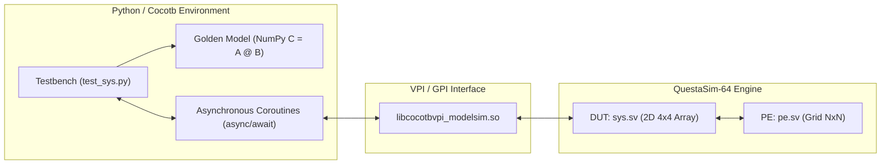

# Simulation Results and Cocotb Verification Flow

This document describes the functional verification environment based on **Cocotb** (Python) and **QuestaSim-64** for the 2D systolic array [sys.sv](../RTL/sys.sv) and its processing elements [pe.sv](../RTL/pe.sv).

---

## 1. Cosimulation Architecture

The verification environment couples a high-level testbench written in **Python 3.12** with the commercial HDL simulator **QuestaSim (Siemens EDA / Mentor Graphics)** through the standard **VPI** (Verilog Procedural Interface).



### Key Advantages of Cocotb over Traditional SystemVerilog Testbenches:
1. **Instant Golden Model Reference**: Direct calculation of expected results using NumPy matrix multiplication: `C_expected = A @ B`.
2. **Dynamic & Parametric Stimulus Generation**: Effortless creation of diverse matrix shapes, zero-padded rectangular matrices, vectors, and randomized data distributions.
3. **Fine-Grained Concurrency Control**: Uses asynchronous coroutines (`stream_A` and `sample_C`) to drive and sample systolic wavefronts in parallel.
4. **High Simulation Throughput**: Native C++ VPI bridging enables simulation speeds exceeding 50,000 ns/s.

---

## 2. Systolic Stimulus & Sampling Wavefront

The systolic array implements a **Weight-Stationary (WS)** $4 \times 4$ architecture:
- **Weight Matrix $B$**: Pre-loaded into the internal `weight_q` registers of each Processing Element (PE) before matrix computation begins.
- **Input Matrix $A$**: Streamed row-by-row from the left (`data_i`). The internal skew network (`ff_skew`) delays row $r$ by $r$ clock cycles.
- **Partial Accumulations $C$**: Flow vertically from top to bottom across columns ($c$).

### Output Wavefront Timing Equation
Due to the horizontal input skew ($r$ cycles delay) and vertical accumulation pipeline latency ($1$ cycle per PE stage), output element $C_{i, c}$ (row $i$, column $c$) appears at the bottom output `result_o[c]` according to the deterministic relationship:

$$T_{\text{valid}}(i, c) = 4 + i + c \quad [\text{clock cycles}]$$

| Relative Cycle ($T$) | `result_o[0]` | `result_o[1]` | `result_o[2]` | `result_o[3]` |
| :---: | :---: | :---: | :---: | :---: |
| **4** | $C_{0, 0}$ | - | - | - |
| **5** | $C_{1, 0}$ | $C_{0, 1}$ | - | - |
| **6** | $C_{2, 0}$ | $C_{1, 1}$ | $C_{0, 2}$ | - |
| **7** | $C_{3, 0}$ | $C_{2, 1}$ | $C_{1, 2}$ | $C_{0, 3}$ |
| **8** | - | $C_{3, 1}$ | $C_{2, 2}$ | $C_{1, 3}$ |
| **9** | - | - | $C_{3, 2}$ | $C_{2, 3}$ |
| **10** | - | - | - | $C_{3, 3}$ |

The testbench monitor samples each column $c$ in the window $T \in [4+c, 4+c+N)$, reconstructing matrix $C$ with exact cycle-accurate fidelity.

---

## 3. Zero-Padding Methodology for Rectangular GEMM

To support general rectangular operations of dimensions $(M \times K) \times (K \times P)$ with $M, K, P \le 4$:
1. Matrix $A$ ($M \times K$) is placed in the upper-left corner of a zero-padded $4 \times 4$ matrix:
   $$A_{\text{pad}} = \begin{bmatrix} A_{M \times K} & \mathbf{0} \\ \mathbf{0} & \mathbf{0} \end{bmatrix}$$
2. Matrix $B$ ($K \times P$) is placed in the upper-left corner of a zero-padded $4 \times 4$ matrix:
   $$B_{\text{pad}} = \begin{bmatrix} B_{K \times P} & \mathbf{0} \\ \mathbf{0} & \mathbf{0} \end{bmatrix}$$
3. The systolic array computes $C_{\text{pad}} = A_{\text{pad}} \times B_{\text{pad}}$. The padded zeros ensure zero partial sums for inactive dimensions:
   $$C_{\text{pad}}[i][j] = \sum_{k=0}^{K-1} A[i][k] \cdot B[k][j] + \sum_{k=K}^{3} 0 \cdot 0 = C[i][j]$$
4. The testbench extracts and verifies the active submatrix $C_{M \times P}$.

---

## 4. Test Suite Overview

| Test ID | Test Function | Logical Dimensions | Description |
|---|---|---|---|
| **TEST 1** | `test_01_identity` | $(4 \times 4) \times (4 \times 4)$ | Identity matrix multiplication ($A \times I = A$). |
| **TEST 2** | `test_02_known_values` | $(4 \times 4) \times (4 \times 4)$ | Full $4 \times 4$ matrix with precomputed values to verify all PEs. |
| **TEST 3** | `test_03_padded_2x3_by_3x4` | $(2 \times 3) \times (3 \times 4)$ | Rectangular multiplication with zero-padding ($M=2, K=3, P=4$). |
| **TEST 4** | `test_04_padded_2x2_by_2x2` | $(2 \times 2) \times (2 \times 2)$ | Reduced square matrix multiplication with zero-padding. |
| **TEST 5** | `test_05_padded_3x2_by_2x4` | $(3 \times 2) \times (2 \times 4)$ | Rectangular multiplication with inner dimension $K=2$. |
| **TEST 6** | `test_06_random_full_4x4` | $(4 \times 4) \times (4 \times 4)$ | 5 consecutive random matrix multiplications with entries in $[0, 100]$. |
| **TEST 7** | `test_07_random_padded_shapes` | Multiple $(1 \times 4, 4 \times 1, 3 \times 3, 1 \times 2)$ | 4 iterations of asymmetric rectangular shapes with zero-padding. |

---

## 5. Regression Test Results

All tests completed successfully with a 100% pass rate and zero mismatches against the NumPy golden model.

```text
***********************************************************************************************
** TEST                                   STATUS  SIM TIME (ns)  REAL TIME (s)  RATIO (ns/s) **
***********************************************************************************************
** test_sys.test_01_identity               PASS         150.00           0.00      56758.11  **
** test_sys.test_02_known_values           PASS         160.00           0.00      89265.49  **
** test_sys.test_03_padded_2x3_by_3x4      PASS         160.00           0.00     100245.41  **
** test_sys.test_04_padded_2x2_by_2x2      PASS         160.00           0.00     100399.21  **
** test_sys.test_05_padded_3x2_by_2x4      PASS         160.00           0.00     103534.54  **
** test_sys.test_06_random_full_4x4        PASS         800.00           0.02      40471.56  **
** test_sys.test_07_random_padded_shapes   PASS         640.00           0.01      84052.31  **
***********************************************************************************************
** TESTS=7 PASS=7 FAIL=0 SKIP=0                        2230.01           0.04      58277.12  **
***********************************************************************************************
```

- **Total Test Suites**: 7 suites (encompassing 14 distinct matrix multiplications).
- **Passed Tests**: 7/7 (100%).
- **Failures / Errors**: 0.
- **Total Simulated Time**: 2230.01 ns.
- **Total CPU Elapsed Time**: ~0.04 seconds.
- **Average Performance**: ~58,000 simulated ns per CPU second.

---

## 6. How to Run the Tests

### Method 1: Direct Bash Script (Recommended)
From the `sim_py/` directory:
```bash
./run.sh
```

### Method 2: Standard Cocotb Makefile
Activate the virtual environment and invoke `make`:
```bash
source ../.venv/bin/activate
make SIM=modelsim
```

### Method 3: Interactive GUI Waveform Viewing
To launch the QuestaSim graphical interface and inspect waveforms during Cocotb execution:
```bash
source ../.venv/bin/activate
make SIM=modelsim GUI=1
```
